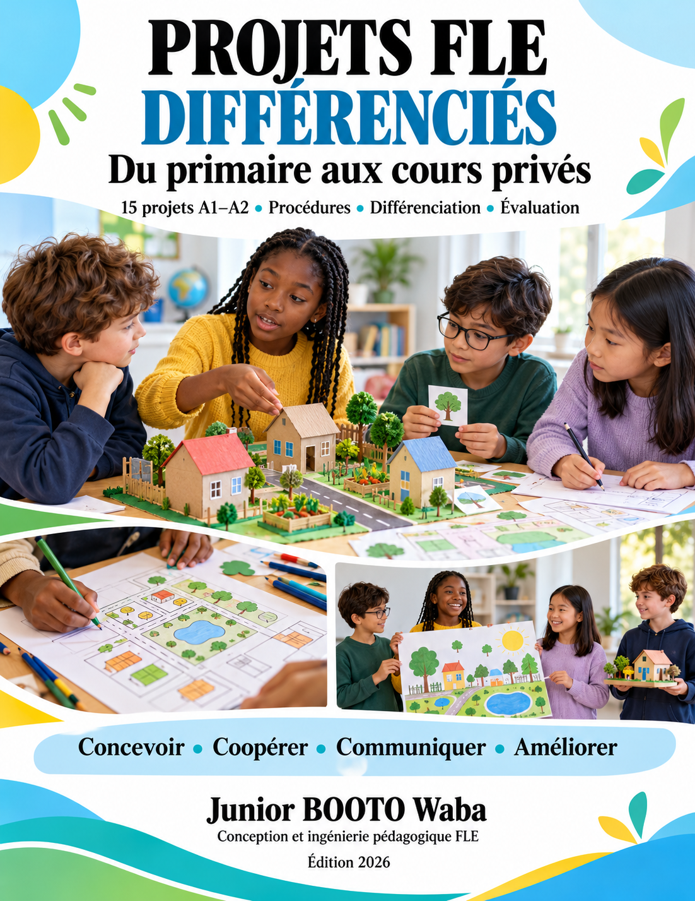

# Projets FLE différenciés du primaire aux cours privés

**Junior BOOTO Waba · Conception et ingénierie pédagogique FLE · Édition 2026**

Quinze projets A1–A2, organisés selon trois trimestres et les Grades 1 à 5, pour utiliser le français dans une tâche concrète. Le guide de **55 pages** propose des procédures, des aides graduées et des preuves individuelles de réussite. Il est adaptable à l’école et aux cours privés.

[Consulter le PDF complet](Projets_FLE_Differencies_Junior_BOOTO.pdf) · [Ouvrir la version Word](Projets_FLE_Differencies_Junior_BOOTO.docx) · [Présentation sur mon site](https://junior-booto-fle.juniorbooto.chatgpt.site/projets-fle-differencies.html)

## Une production utile testée puis améliorée

Chaque projet s’adresse à un destinataire. Un partenaire teste la production ; l’auteur utilise ce retour pour améliorer une information, une phrase ou un choix. Les contraintes donnent un but à l’échange : budget, météo, besoin particulier, information manquante ou décision collective.

## Contenu du guide

- Une mission, une production finale, une question d’enquête et une procédure sur trois séances de 45 minutes.
- Trois parcours flexibles : soutien, consolidation et approfondissement, avec un socle commun.
- Une fiche apprenant, des scripts à lire par l’enseignant, des textes de lecture et des réponses possibles.
- Des critères « Je peux… », une trace individuelle et des outils de portfolio.
- Des adaptations aux cours privés, une banque de prolongements et les références.

## Choisir un projet

| Projet | Grade | Trimestre | Titre | Pages du guide |
| --- | --- | --- | --- | --- |
| 01 | 1 | 1 | Mon passeport et notre abécédaire | 7–9 |
| 02 | 1 | 2 | La maison accueillante de notre famille fictive | 10–12 |
| 03 | 1 | 3 | Ma journée idéale dans la nature | 13–15 |
| 04 | 2 | 1 | La galerie de nos identités et talents | 16–18 |
| 05 | 2 | 2 | Bien dans mon corps et prêt pour le temps | 19–21 |
| 06 | 2 | 3 | Notre parcours gourmand dans une ville imaginaire | 22–24 |
| 07 | 3 | 1 | Deux portraits et deux façons de vivre | 25–27 |
| 08 | 3 | 2 | Une sortie sûre malgré la météo | 28–30 |
| 09 | 3 | 3 | Notre journal Hier aujourd’hui demain | 31–33 |
| 10 | 4 | 1 | Un festival francophone imaginé par les élèves | 34–36 |
| 11 | 4 | 2 | Le salon des métiers et services responsables | 37–39 |
| 12 | 4 | 3 | Une campagne citoyenne dont on peut suivre les effets | 40–42 |
| 13 | 5 | 1 | Le carnet interculturel de nos habitudes | 43–45 |
| 14 | 5 | 2 | Le journal francophone qui vérifie ses informations | 46–48 |
| 15 | 5 | 3 | Le sommet francophone pour la planète et les droits | 49–51 |

## Différenciation et accessibilité

Les apprenants peuvent parler, dessiner, manipuler, organiser, écouter, enquêter et réfléchir. Ces possibilités restent ouvertes à tous : aucun type d’intelligence fixe n’est attribué. Les aides sont ajustées après observation. Le support choisi ne remplace pas la preuve de la compétence langagière évaluée.

Le niveau réel prime sur le grade. Les projets avancés proposent un socle A1 ; les objectifs A2 sont des cibles pédagogiques, pas une validation automatique. Les traces de compréhension, d’écriture et d’interaction restent complémentaires.

## Mise en œuvre

1. Observer les acquis et choisir le niveau ainsi que les aides.
2. Préparer la langue avec les supports originaux.
3. Construire le projet et le tester auprès d’un partenaire.
4. Réviser puis recueillir une preuve individuelle.
5. Conserver les essais dans le portfolio et préparer un transfert.

Matériel : papier, cartes, crayons, dictionnaire et portfolio. Numérique facultatif. En cours individuel, l’enseignant joue le destinataire en conservant un manque d’information.

## Statut et attribution

**Guide conçu ; expérimentation et résultats d’apprentissage à documenter.** Les critères sont des outils locaux ; aucune homologation CECRL ou IB n’est revendiquée.

Les idées de départ sont adaptées de Dana Carton et Anthony Caprio, *En Français Practical Conversational French*, 2e édition, Heinle & Heinle, 1981, et de mon *Programme of Inquiry FLE Grades 1 à 5*. Les pages sources sont indiquées dans le guide. Les procédures, scripts, textes, questions et parcours de cette collection sont des adaptations originales. Le manuel tiers n’est pas redistribué.

Couverture : illustration générée avec OpenAI en octobre 2026, sous ma direction. Les personnages sont fictifs. Aucune donnée d’élève ni d’établissement n’est publiée. Aucune licence générale de réutilisation n’est définie ; conserver les attributions et vérifier les droits avant redistribution.

[Mon site](https://junior-booto-fle.juniorbooto.chatgpt.site) · [LinkedIn](https://www.linkedin.com/in/junior-booto-1a9b3a161) · [Retour au catalogue](../../CATALOGUE.md)
